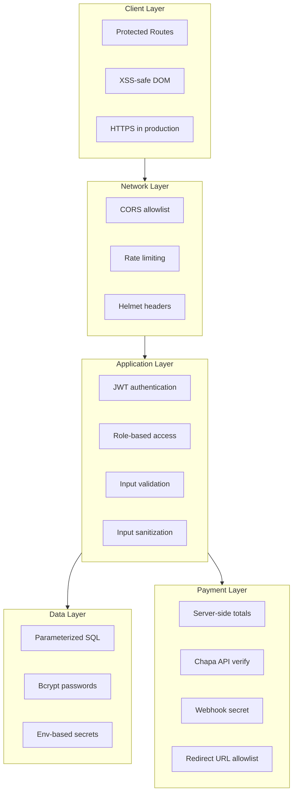

# Visionary Eyeglass Store — Security Architecture

**Assignment / presentation guide**  
This document explains the security mechanisms implemented in the full-stack eyeglass e-commerce application.

---

## 1. Defense in Depth (Overview)

Security is applied in **layers**. If one layer fails, others still protect the system.

---

## 2. Authentication & Authorization

### 2.1 JWT (JSON Web Token) authentication

| Item | Implementation |
|------|----------------|
| **Files** | `server/middlewares/auth.js`, `server/controllers/userController.js` |
| **How it works** | After login/register, server signs a token with `JWT_SECRET`. Client sends `Authorization: Bearer <token>` on protected routes. |
| **Why** | Stateless auth suitable for SPA + REST API. |
| **Presentation point** | *“We verify identity on every protected API call, not only at login.”* |

**Hardening added:**
- `JWT_SECRET` must be **≥ 32 characters** in production (no hardcoded fallback).
- Token expiry reduced to **7 days** (configurable via `JWT_EXPIRES_IN`).
- User record reloaded from DB on each request (admin revocation reflected).

### 2.2 Password security (Bcrypt)

| Item | Implementation |
|------|----------------|
| **Files** | `server/controllers/userController.js` |
| **How it works** | Passwords hashed with **bcrypt**, 12 rounds. Plain passwords never stored. |
| **Why** | Slow hashing resists brute-force and rainbow tables. |
| **Presentation point** | *“Even if the database leaks, attackers cannot read user passwords.”* |

### 2.3 Password policy (express-validator)

| Rule | Requirement |
|------|-------------|
| Length | Minimum 8 characters |
| Complexity | Uppercase, lowercase, and number |
| Email | Valid format, normalized |

**File:** `server/middlewares/validate.js`  
**Presentation point:** *“Weak passwords are rejected before they reach the database.”*

### 2.4 Role-based access control (RBAC)

| Role | Access |
|------|--------|
| **Guest** | Browse shop, guest cart (localStorage) |
| **User** | Cart API, checkout, profile |
| **Admin** | Products, categories, orders, analytics |

| Layer | Enforcement |
|-------|-------------|
| **Server** | `protect` + `admin` middleware on routes |
| **Client** | `ProtectedRoute` for `/admin` and `/profile` |

**Files:** `server/middlewares/auth.js`, `client/eyeglass/src/components/ProtectedRoute.jsx`  
**Presentation point:** *“UI hiding admin links is not security — the server returns 403 if a non-admin calls admin APIs.”*

### 2.5 Admin registration key

Admin accounts require `ADMIN_REGISTRATION_KEY` in `.env` (not guessable from the client).  
**Presentation point:** *“Privilege escalation is blocked unless the secret key is known.”*

---

## 3. API & Network Security

### 3.1 Helmet (HTTP security headers)

**File:** `server/middlewares/security.js`

| Header / policy | Purpose |
|-----------------|--------|
| Content-Security-Policy | Limits script/style sources (XSS mitigation) |
| X-Content-Type-Options | Stops MIME sniffing |
| X-Frame-Options | Clickjacking protection |
| HSTS (production) | Forces HTTPS |

**Presentation point:** *“Helmet adds browser-level protections automatically.”*

### 3.2 CORS (Cross-Origin Resource Sharing)

**File:** `server/utils/index.js`, `server/utils/securityConfig.js`

- Only allowed origins (e.g. `CLIENT_URL`, localhost in dev) may call the API with credentials.
- Unknown origins receive **403**.

**Presentation point:** *“Random websites cannot call our API from a victim’s browser session.”*

### 3.3 Rate limiting

**File:** `server/middlewares/security.js`

| Limiter | Scope | Limit |
|---------|-------|-------|
| Global API | `/api/*` | 300 / 15 min |
| Auth | login + register | 20 / 15 min |
| Payment | checkout + confirm | 40 / 15 min |
| Webhook | payment webhooks | 60 / min |

**Presentation point:** *“Brute-force login and DDoS-style flooding are throttled.”*

### 3.4 HTTP Parameter Pollution (HPP)

**Package:** `hpp`  
Duplicate query/body parameters are normalized to prevent bypass tricks.

### 3.5 Request size limits

- JSON body: **2 MB** (profile images as base64).
- Webhook body: **1 MB**.

**Presentation point:** *“Large payload attacks are blocked early.”*

### 3.6 Removed insecure debug endpoint

`POST /api/test` (echoed arbitrary body, no auth) was **removed**.

---

## 4. Input Validation & Sanitization

### 4.1 Server-side validation (express-validator)

Applied to: register, login, profile update.  
**Why:** Client validation can be bypassed; server must be the source of truth.

### 4.2 Input sanitization

**File:** `server/utils/securityConfig.js` → `sanitizeObject`

- Strips HTML tags from string fields.
- Blocks Mongo-style operator keys (`$gt`, etc.) in JSON bodies (defense in depth).

### 4.3 SQL injection prevention

**Pattern:** Parameterized queries everywhere (`?` placeholders).  
**Example:** `SELECT * FROM users WHERE email = ?`  
**Presentation point:** *“User input is never concatenated into SQL strings.”*

---

## 5. Cross-Site Scripting (XSS)

| Location | Fix |
|----------|-----|
| Shop notifications | `textContent` instead of `innerHTML` |
| Helmet CSP | Restricts inline scripts |
| API sanitization | Strips HTML from request bodies |

**Presentation point:** *“Stored/reflected XSS in notifications is prevented by not interpreting user text as HTML.”*

**Note for presentation:** Tokens in `localStorage` are still vulnerable if XSS exists — CSP + sanitization reduce that risk. Production should use **httpOnly cookies** for highest assurance (future improvement).

---

## 6. Payment Security

### 6.1 Server-side price authority

Checkout totals are computed on the **server** from database cart prices — not from client-submitted amounts.

**Presentation point:** *“Users cannot change the price in DevTools and pay less.”*

### 6.2 Chapa transaction verification

Before marking an order `paid`, the server calls **Chapa’s verify API** with the secret key.

### 6.3 Webhook authentication

**File:** `server/middlewares/webhookAuth.js`

- Requires header `X-Webhook-Secret` or `X-Chapa-Signature` matching `CHAPA_WEBHOOK_SECRET`.
- Uses **timing-safe comparison** (prevents timing attacks).

**Presentation point:** *“Fake webhooks cannot mark orders as paid.”*

### 6.4 Open redirect prevention

`successUrl` and `cancelUrl` must match allowed client origins.  
**File:** `server/utils/securityConfig.js` → `isAllowedRedirectUrl`

### 6.5 Payment confirm authorization

Confirm endpoint checks `order.user_id === req.user.id` → **403** if mismatch.

### 6.6 Webhook hardening

- `tx_ref` accepted from **body only** (not query string) to reduce log/history leakage.
- Dedicated rate limit on webhook routes.

---

## 7. Data & Configuration Security

### 7.1 Environment variables

| Secret | Purpose |
|--------|---------|
| `JWT_SECRET` | Signs tokens |
| `MYSQL_*` | Database credentials |
| `CHAPA_SECRET_KEY` | Payment API |
| `CHAPA_WEBHOOK_SECRET` | Webhook auth |
| `ADMIN_REGISTRATION_KEY` | Admin signup |

**File:** `server/config/mysql.js` now reads `MYSQL_*` from `.env` (no hardcoded `root` / empty password in production config).

### 7.2 Sensitive data logging

- Registration no longer logs full `req.body` (passwords were exposed in logs).

### 7.3 Profile image validation

- Allowed MIME types: JPEG, PNG, WebP, GIF only.
- Max size: 2 MB (base64 decoded).

---

## 8. Client-Side Security

| Mechanism | File | Purpose |
|-----------|------|---------|
| Protected routes | `ProtectedRoute.jsx` | Blocks unauthenticated access to admin/profile |
| Admin default fix | `AdminDashboard.jsx` | `isAdmin` defaults to **false**, not true |
| API auth header | `redux/api/*.js` | Bearer token on API calls |
| Payment tx ref | `utils/payment.js` | Supports Chapa `trx_ref` + session fallback |

---

## 9. Security Testing Checklist (Demo for Class)

| Test | Expected result |
|------|-----------------|
| Access `/admin` without login | Redirect to login |
| Call `GET /api/payments/admin/orders` without token | 401 |
| Call admin API as normal user | 403 |
| 21 rapid login attempts | Rate limit message |
| Register with password `12345678` | Validation error |
| POST webhook without secret | 401 (when `CHAPA_WEBHOOK_SECRET` set) |
| SQL in email field `' OR 1=1 --` | Query fails safely (parameterized) |

---

## 10. OWASP Top 10 Mapping (Quick Reference)

| OWASP risk | Our mitigation |
|------------|----------------|
| Broken Access Control | JWT + RBAC + order ownership checks |
| Cryptographic Failures | Bcrypt, JWT secret, HTTPS in prod |
| Injection | Parameterized SQL + sanitization |
| Insecure Design | Server-side payment totals |
| Security Misconfiguration | Helmet, CORS, env secrets |
| Vulnerable Components | `npm audit` (run regularly) |
| Auth Failures | Rate limit, password policy |
| Data Integrity | Webhook secret + Chapa verify |
| Logging Failures | No password logging |
| SSRF | Redirect URL allowlist |

---

## 11. Production Deployment Recommendations

1. Set strong `JWT_SECRET` (32+ random characters).
2. Set `NODE_ENV=production`.
3. Use HTTPS (TLS) on reverse proxy (Nginx / Cloudflare).
4. Set `CHAPA_WEBHOOK_SECRET` and configure Chapa dashboard.
5. Restrict `CLIENT_URL` to your real domain only.
6. Use strong MySQL password; limit DB network access.
7. Run `npm audit fix` periodically.

---

## 12. File Reference (Where to Show in Code Review)

| Security feature | Primary file(s) |
|------------------|-----------------|
| Helmet, rate limits | `server/middlewares/security.js` |
| JWT / admin guard | `server/middlewares/auth.js` |
| Validation rules | `server/middlewares/validate.js` |
| Webhook auth | `server/middlewares/webhookAuth.js` |
| Secrets & URL allowlist | `server/utils/securityConfig.js` |
| App security stack | `server/utils/index.js` |
| Auth controller | `server/controllers/userController.js` |
| Payment security | `server/controllers/paymentController.js` |
| Client route guard | `client/eyeglass/src/components/ProtectedRoute.jsx` |

---

## 13. Sample Presentation Script (2–3 minutes)

> “Our eyeglass store uses **defense in depth**. Users authenticate with **JWT** and passwords stored with **bcrypt**. Every protected route checks the token and reloads the user from MySQL using **parameterized queries** to prevent SQL injection.
>
> We added **Helmet** for secure HTTP headers, **CORS** so only our frontend can call the API, and **rate limiting** against brute force. Inputs pass **express-validator** and sanitization before controllers run.
>
> **Admin features** require the admin role on the server, and the React app uses **protected routes** so the UI matches API policy. Payments never trust the browser for price: totals are computed server-side, confirmed with **Chapa verify**, and webhooks require a **shared secret**. Redirect URLs after payment are **allowlisted** to stop open redirects.
>
> Together, these mechanisms address authentication, authorization, injection, XSS, abuse, and payment fraud — the main risks for an e-commerce web application.”

---

*Document version: 1.0 — aligned with project security implementation.*
